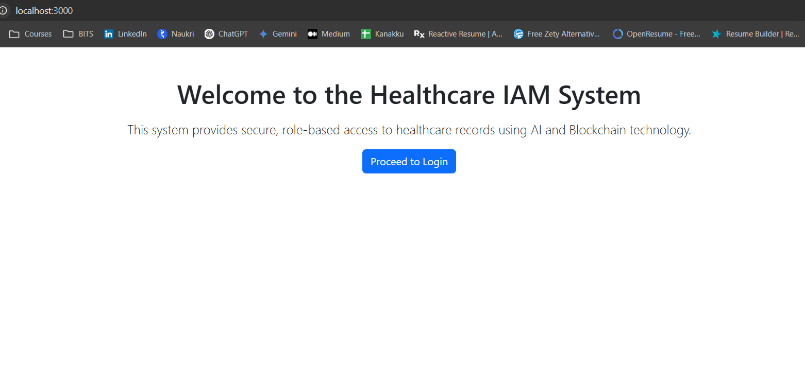
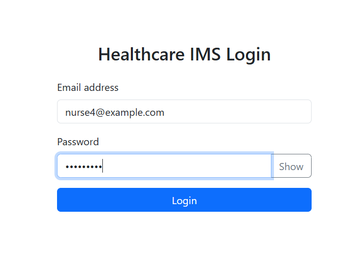
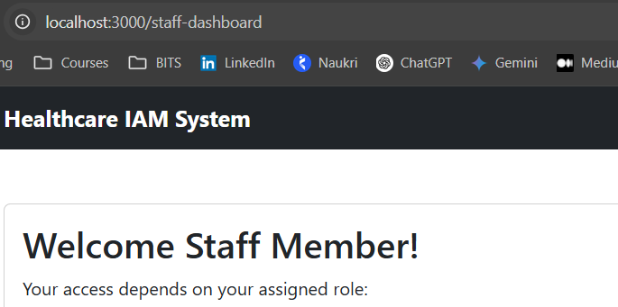
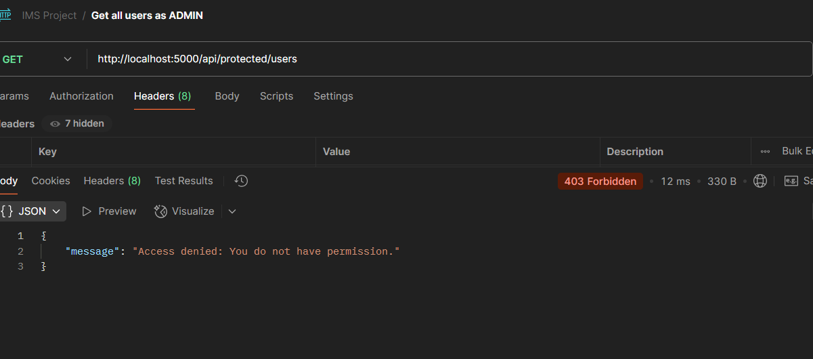
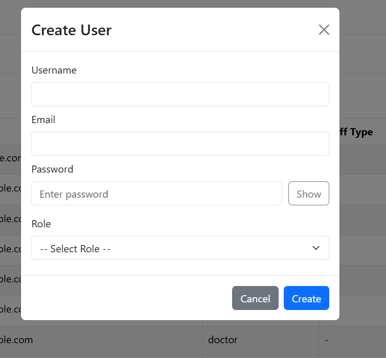
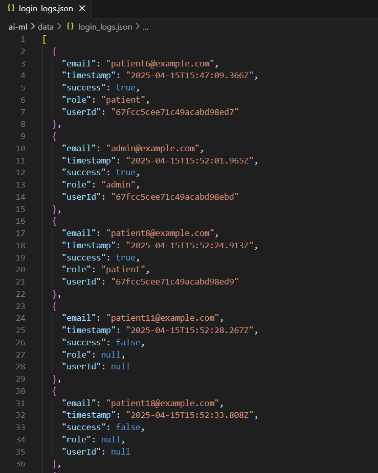
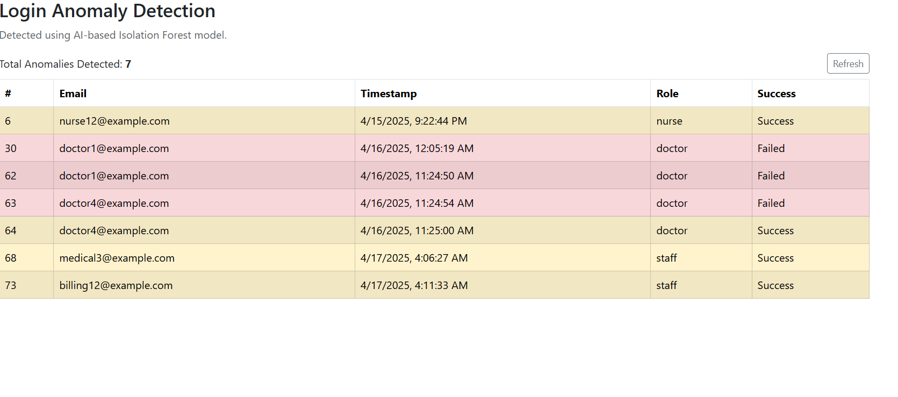

# 🏥 Healthcare-Focused Identity Management System (HFIMS)

An academic capstone project that reimagines how Identity & Access Management (IAM) can be tailored for healthcare environments. This system offers robust user access controls, secure data handling, anomaly detection via AI, and a simplified blockchain log simulation — all in one platform.

---

## 🚀 Features

- 🔐 Role-based Access Control for Admins, Doctors, Patients
- 📜 Secure Login, Token-based Auth (JWT)
- 🧠 AI-Powered Anomaly Detection for login patterns
- ⛓️ Simulated Blockchain Ledger to track sensitive actions
- 📁 Manage Users, Medical Records, Access Logs
- 📊 Admin Analytics Dashboard for unusual behavior detection

---

## 🛠 Tech Stack

**Frontend:** ReactJS, Tailwind CSS  
**Backend:** Node.js, Express.js  
**Database:** MongoDB  
**AI Module:** Python (Anomaly Detection)  
**Blockchain Sim:** Custom JS-based Ledger System

---

## 📁 Project Structure

HFIMS/
│
├── client/              # React frontend
├── server/              # Node.js backend API
├── ai-anomaly/          # Python script for anomaly detection
├── models/              # MongoDB Mongoose models
├── routes/              # Express routes
└── README.md

---

## 📸 Screenshots

Here are a few key interfaces from the project:

---

## 🧪 How to Run This Project Locally

1. Clone the Repo
    git clone https://github.com/Sowmya2300/Healthcare-Focused--Identity-Management-System-HFIMS-.git
    cd Healthcare-Focused--Identity-Management-System-HFIMS-
   
2. Start Backend
    cd server
    npm install
    npm start

3. Start Frontend
    cd client
    npm install
    npm run dev

4. Anomaly Detection (Python Script)
    Run the script located in ai-anomaly/ directory manually to simulate login anomaly detection.
    ⚠️ Ensure MongoDB is running locally and .env files are correctly configured for backend.

---

## 🔑 Sample Admin Credentials

Username: admin@example.com
Password: Admin@123

(You can also register other users as Doctors/Patients once the sign-up module is added.)

---

## 🚧 Upcoming Improvements

- [ ] Signup & Authentication UI
- [ ] Role-based Route Guards
- [ ] UI Polish & Error Boundaries

---

## 🗺️ Future Enhancements

Dockerization for deployment.
Real blockchain integration (e.g., Hyperledger or Ethereum).
Role-based route protection with refresh token rotation.
Expand AI module with live stream analysis.

---

## Acknowledgements

This project was submitted as part of the M.Tech in Software Engineering program at BITS Pilani WILP.
Special thanks to:
🎓 Mr. Shubham Bele (Supervisor)
🎓 Dr. Summia Parveen (Mentor)

Gratitude to Capgemini and teammates for their support during this academic journey.

---

## License

MIT License

---

## 📣 Let's Connect!

If this project interests you or if you're hiring for full-stack/AI-integrated roles, let's connect on LinkedIn!

